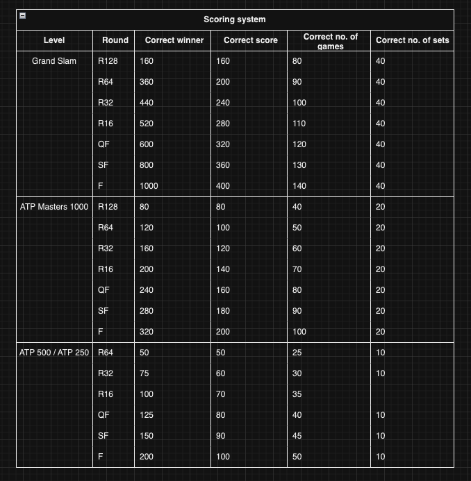

# FantasyTennis

1. [Getting Started](#getting-started)
1. [The App](#the-app)
    1. [Planning](#planning)
    1. [Backend](#backend)
    1. [Frontend](#frontend)
1. [Upcoming Features](#upcoming-features)
1. [Languages, Frameworks, Libraries and Websites Use](#languages-frameworks-libraries-and-websites-used)
1. [Social Media Links](#social-media-links)

FantasyTennis is an app which allows users to predict tournament results. Right up until matches start, users will be able to predict who will win each match during a tournament. Users will be able to earn points based on whether they predict the correct winner, the correct number of sets, the correct number of games and the correct score in a match.

## Getting Started

Each week, when a tournament's draw becomes available, users will be able to make their own prediction for the tournament. They will predict the winner of each match as well as the score of each match. Based on the scoring rubric below, users will be awarded points based on (i) the level of the tournament, (ii) which round the match is, (iii) whether they predicted the correct winner; (iv) whether they predicted the correct number of sets; (v) whether they predicted the correct number of games; and (vi) whether they predicted the correct score.



## The App

The app is built using the MEVN stack (Mongoose, Express, Vue and Node.js).

### Planning

##### [Entity relationship diagram](https://drive.google.com/file/d/1GW836gya2lA-cYJIx7QOMXJ1mb_laLAb/view?usp=sharing)


##### [Component hierarchy diagram](https://drive.google.com/file/d/128_P-6jsxjCeeqPW_GPVhDsXsflxS2cI/view?usp=sharing)


##### [Wireframe](https://www.figma.com/file/z7MjgsNpTdt9BO59YHnqip/FantasyATP?type=design&node-id=0%3A1&mode=dev&t=bIkm2yj7S2aqeHXT-1)

The design of the app is inspired by the design of the [ATP](https://www.atptour.com/en) website, as demonstrated by the wireframe.


##### [Project management](https://trello.com/invite/b/Yq4RN6ek/ATTI8d280093b9dc76ca176479456457a90a4A086300/fantasytennis)


### Backend

The backend is designed to take as much work away from the front-end as possible by crafting very specific controllers for any searches the front-end might need. For example, EditionsController.js allows the client to request an edition by id, editions by tournament, editions by year, upcoming editions and editions by winner or by finalist. Below is an example.

```js
const getUpcomingEditions = async(req, res) => {
    try {
        const editions = await Edition.find({}).populate('tourney')
        const upcoming = editions.filter(edition => edition.end_date > Date.now())
        const sorted = upcoming.toSorted((a, b) => {
            return a.start_date - b.start_date
        })
        if (sorted) {
            res.json(sorted)
        } else {
            return res.status(404).send('Edition does not exist')
        }
    } catch (error) {
        return res.status(500).send(error.message)
    }
}
```

Moreover, the controllers are all set up to allow full CRUD on the front end. In particular, when a match score is updated on the front end, it will update not only the match score document, but it will also update any predictions which reference that particular match as well as the add the correct number of points to the user's profile.

```js
const updateMatch = async(req, res) => {
    try {
        const { id } = req.params
        const updatedMatch = await MatchScore.findByIdAndUpdate(id, req.body, {new: true})

        let finalScore = []
        let setCount = 0
        let gamesCount = 0

        for (let i = 1; i<=5; i++) {
            const set = updatedMatch.score[`set${i}`]
            const tiebreak = updatedMatch.score[`tiebreak${i}`]

            if (set.length > 0) {
                finalScore = finalScore.concat(set)
                setCount++
                gamesCount += set.reduce((acc, val) => acc + val, 0)
            }

            if (tiebreak.length > 0) {
                finalScore = finalScore.concat(tiebreak)
            }
        }
        const edition = await Edition.findById(updatedMatch.edition)
        const pointsMatrix = await Point.find({level: edition.category, round: updatedMatch.round})
        const predictions = await Prediction.find({"predictions.match": updatedMatch._id})
        const arraysAreEqual = (array1, array2) => {
            return array1.length === array2.length && array1.every((value, index) => value === array2[index])
        }
        for (let i=0; i < predictions.length; i++) {
            let predictedScore = []
            let predictedSets = 0
            let predictedGames = 0
            const predictionMatch = predictions[i].predictions.find(prediction => prediction.match.toString() === updatedMatch._id.toString());
            for (let n=1; n<=5; n++) {
                const predictedSet = predictionMatch[`set${n}`]
                const predictedTiebreak = predictionMatch[`tiebreak${n}`]

                if (predictedSet.length > 0) {
                    predictedScore = predictedScore.concat(predictedSet)
                    predictedSets++
                    predictedGames += predictedSet.reduce((acc, val) => acc + val, 0)
                }

                if (predictedTiebreak.length > 0) {
                    predictedScore = predictedScore.concat(predictedTiebreak)
                }
            }
            
            let predictionPoints = 0
            if (arraysAreEqual(finalScore, predictedScore)) {
                predictionPoints += pointsMatrix[0].score
            }
            if (setCount === predictedSets) {
                predictionPoints += pointsMatrix[0].sets
            }
            if (gamesCount === predictedGames) {
                predictionPoints += pointsMatrix[0].games
            }
            if (predictionMatch.winner === updatedMatch.winner_id) {
                predictionPoints += pointsMatrix[0].winner
            }
            const updatedPrediction = await Prediction.findByIdAndUpdate(predictions[i]._id, {$inc: {points: predictionPoints}}, {new: true})
            const user = await User.findByIdAndUpdate(predictions[i].user, {$inc: {points: predictionPoints}}, {new: true})
        }
        if (updatedMatch) {
            return res.status(200).json(updatedMatch)
        }
        throw new Error ('Match not found')
    } catch (error) {
        return res.status(500).send(error.message)
    }
}
```

### Frontend

The homepage of the app lists any upcoming tournaments in the calendar year, as well as tournaments which have not been completed yet. For tournaments which have released their draws but which have not started, users are able to create or edit their prediction for that tournament. If the tournament has started and are currently running, users are able to view their predictions as well as the draw as it currently stands.


The results archive allows users to view all past tournaments by year. Users can view previous winners of a tournament as well as the details of a particular edition of a tournament.


Finally, users can view key stats and background about players they would like to know more about.


Users can search tournaments or players by name from anywhere on the app. When users click on the search icon in the nav bar, the search box will appear on top of any page which they are currently viewing. The search input is passed into the axios call (which is saved in the services folder) and the response from the axios call is parsed into tournament results and player results.

```js
const emits = defineEmits(['closeSearch'])

const searchTerm = ref(null)
const searched = ref(false)
const tournamentResults = ref(null)
const playerResults = ref(null)

const submitSearch = () => {
    event.preventDefault()
    SearchService.searchCall(searchTerm.value)
        .then((response) => {
            searched.value = true
            tournamentResults.value = response.data.tournaments
            playerResults.value = response.data.players
        })
        .catch((error) => {
            console.log(error)
        })
}

const closeSearch = () => {
    emits('closeSearch', true)
}
```

```html
<div class="search-wrapper">
        <FontAwesomeIcon class="search-icon" :icon="faCircleXmark" @click="closeSearch" />
        <input type="text" v-model="searchTerm" placeholder="Search player or tournament" @change="submitSearch" />
        <div class="search-results-container" v-if="searched">
            <div class="results">
                <h1>Tournaments</h1>
                <div v-if="tournamentResults.length === 0">No results matching search</div>
                <div v-else v-for="result in tournamentResults" :key="result._id" ><RouterLink class="hover-link" :to="{ name: 'Tournament', params: { id: result._id } }" @click="closeSearch" >{{ result.name }}</RouterLink></div>
            </div>
            <div class="results">
                <h1>Players</h1>
                <div v-if="playerResults.length === 0">No results matching search</div>
                <div v-else v-for="result in playerResults" :key="result._id" ><RouterLink class="hover-link" :to="{ name: 'PlayerLayout', params: { id: result._id} }" @click="closeSearch" >{{ result.full_name }}</RouterLink></div>
            </div>
        </div>
    </div>
```

## Upcoming Features

- More past data will be added
- Player head-to-heads
- Player stats
- Player activity
- More filters and searches (such as searching players by nationality or matches by umpire)
- Leagues to play in with friends

## Languages, Frameworks, Libraries and Websites Used

- [Trello](https://trello.com/)
- [Figma](https://www.figma.com/)
- [Draw.io](https://draw.io/)
- [FontAwesome](https://fontawesome.com/)
- Python
- Javascript
- CSS
- HTML
- Vue
- MongoDB / Mongoose
- Express
- Node
- Axios
- [ATP](https://www.atptour.com/en)
- [ITF](https://www.itftennis.com/en/)

## Social Media Links

- [Github](https://github.com/cys2110)
- [LinkedIn](www.linkedin.com/in/claire-y-sheridan)

[Back to top](#)